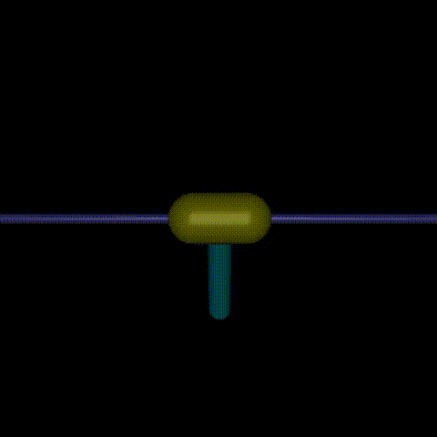
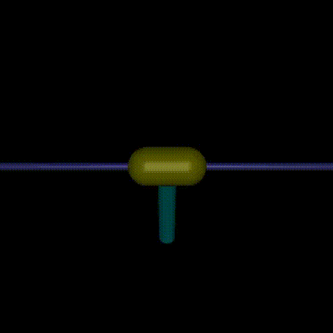
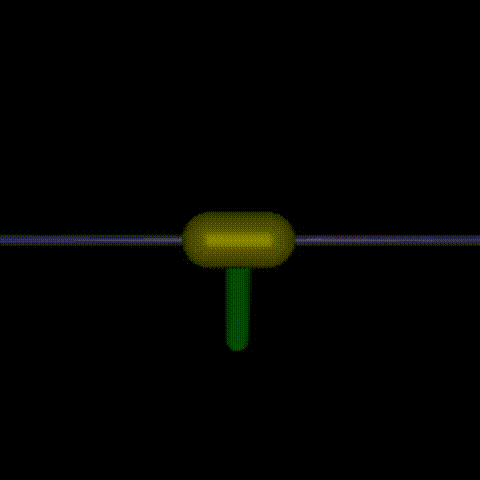
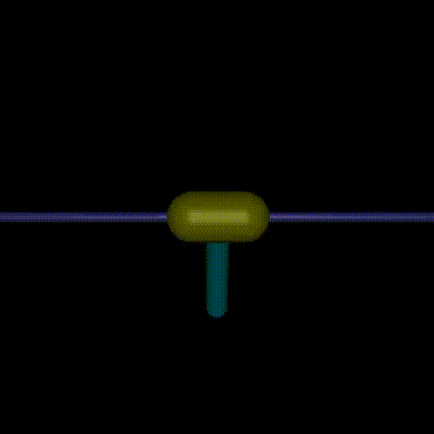

# Reinforcement learning with Partial state observations. 
Most of RL literature has shown experiments with full state information. Here, I try to use the same RL techniques and train algorithms on just some of the outputs of the system. 
I use the information state, which is basically stacking the finite past history of outputs and control inputs and use this as the state of the system.

Environments:
1. 'InvertedPendulum-v4' - swing up task with only position of cart and pole as outputs (the velocities are ignored).

Algorithms:
1. Deep Deterministic Policy Gradient - adapted from source: https://github.com/vwxyzjn/cleanrl/blob/master/cleanrl/ddpg_continuous_action.py and the original paper: https://arxiv.org/abs/1509.02971
2. Soft Actor Critic - adapted from source: https://github.com/vwxyzjn/cleanrl/blob/master/cleanrl/sac_continuous_action.py and the original paper: https://arxiv.org/abs/1801.01290

For more information about information-state check out my work here: https://arxiv.org/abs/2107.08086

## DDPG Learned policy using a history of 10 (q = 10)

## DDPG Learned policy using a history of 2 (q = 2)

## SAC Learned policy on full state (deterministic) 

## SAC Learned policy on full state (stochastic) 

## SAC performance under noise. 

